# Read Me

## Tool Descriptions 

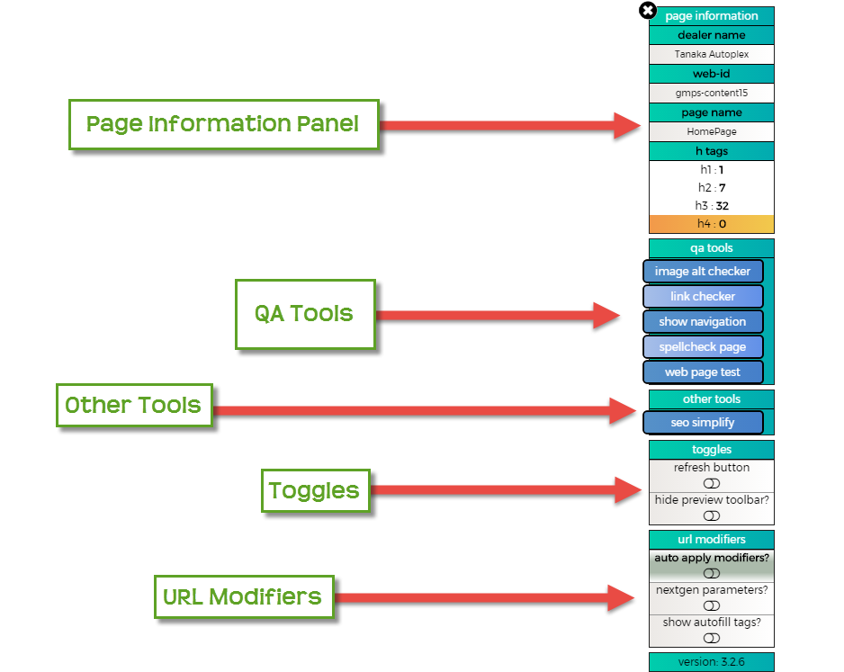

### Other Useful Links 

[Installation Instructions](https://github.com/cirept/QA_Toolbox/tree/7b8726987f1e7bcf68aa2eac0751ead9e02c96b3/docs/Install/README.md)  
 [Change Log](https://github.com/cirept/QA_Toolbox/tree/7b8726987f1e7bcf68aa2eac0751ead9e02c96b3/docs/ChangeLog/README.md)  

## **Page Information Panel** 

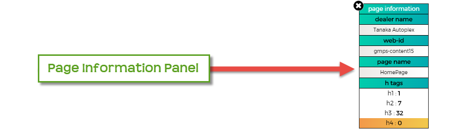

* This panel shows all important information for the current CDK website you are viewing. 

#### **Features** 

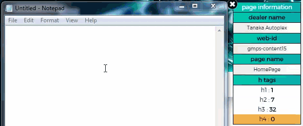

* Clicking on the info area will copy the text to your clipboard.  

  _**There will be no notification.**_

### **Dealer Name** 

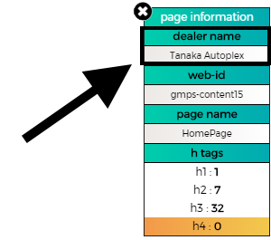

* This area will display the current dealer's _**NAME**_ of the CDK site you are viewing. 
* This dealer name should be the same name as the dealer's "Account" name in Salesforce. 

### **Web ID** 

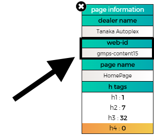

* This area will display the current dealer's _**WEB-ID**_ of the CDK site you are viewing. 
* This web-id should be the same name as the dealer's "WebID" name in Salesforce. 
* This is also used to navigate to the dealer's site in WSM for editting.

### **Page Name** 

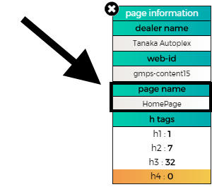

* This area will display the current _**PAGE NAME**_ of the CDK site you are viewing. 
* This information is what the 'generic' page name of the page is called. 
* This will help navigate to a specific page while editting the site in WSM. 

_e.g. LandingPage, HoursAndDirections, MiscPage._  

### **H Tags** 

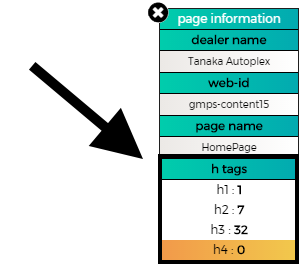

* This area will display the current h tags on the current page you are viewing. 
* Any h tags that have a Zero \(0\) value will be highlighted in orange. 

#### _**Clicking on the area will bring a pop up with all the h tags displayed**_ 

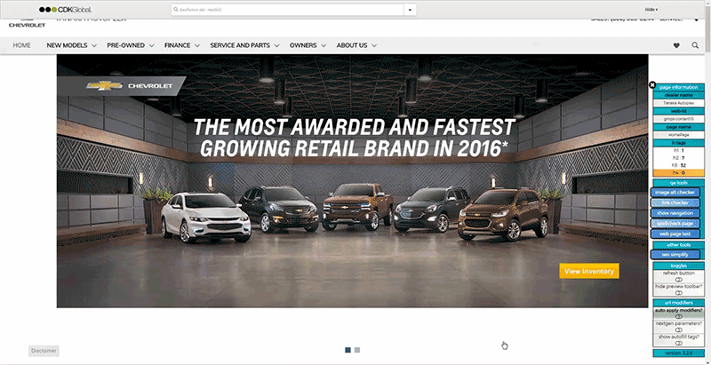

## **QA Tools Panel** 

* This panel has the main QA tools for checking the site. 

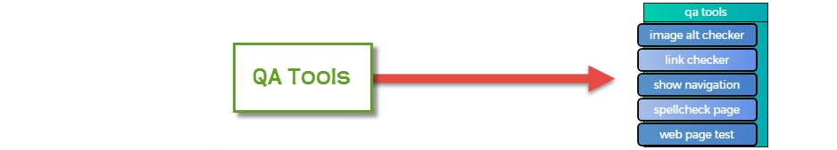

### **Image Checker** 

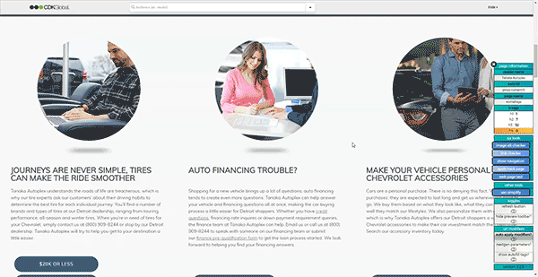

* All images on the page will be highlighted in specific colors that will tell the user what images **have** and **do not have** alt text. 
* **If using this tool on a NEXTGEN site**, please scroll all the way to the bottom of the page to allow all images to load before running the tool. 
* Due to lazy loading, if the tool is run and some images do not have a box around the image please turn off the tool and rerun the tool with that image in view.  

  _**This tool works for both TETRA and NEXTGEN**_  

#### Turning the tool on: 

* Click the 'image alt checker' button inside the 'qa tools' panel. 

#### Turning the tool off: 

* When you are done using the tool, simply click the "turn off" on the legend and the tool will turn itself off. 

#### **Features** 

| Image Checker Functionality |
| :--- |
| 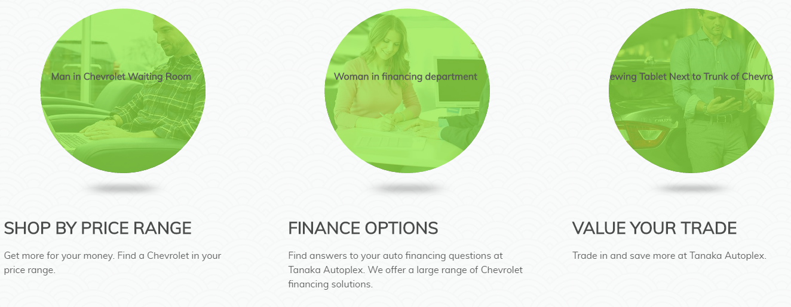 |
| All images on the page will be highlighted with a green or red/pink box.  These colors will signify if the image **has** and **does not have** an alt text. If the image has a green color on over the image, the ALT of the image will appear at the center. |

| Image Checker Legend |
| :--- |
| 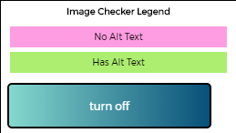 |

### **Link checker** 

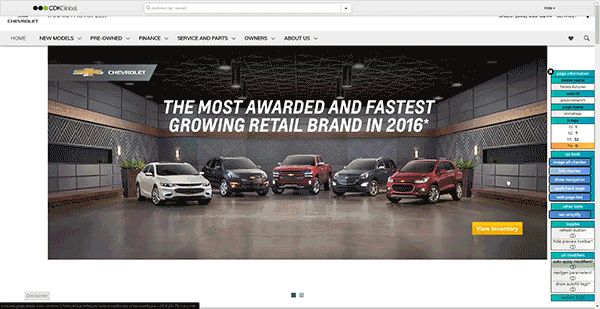

#### **TIP:** 

> _Show Navigation + Link Checker can and should be used together to verify links in the navigation are correct._

* All links on the page will be highlighted with specific colors according to the validity of the link. 
* There are various factors that the tool will use to categorize each link. 
* More detail on those factors are stated below.  

  _**This tool works for both TETRA and NEXTGEN**_

#### **Turning the tool on:** 

* Click the 'link checker' button inside the 'qa tools' panel. 

#### **Turning the tool off:** 

* When you are done using the tool, simply click the "turn off" on the legend and the tool will turn itself off. 

#### **Features** 

| Link Checker Legend |
| :--- |
| 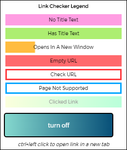 |
| _**'HAS NO title text'**_ |
| All links that DO NOT HAVE title text in the link will be flagged |
| _**'HAS title text'**_ |
| All links that HAVE title text in the html code will be flagged |
| _**'OPENS IN A NEW WINDOW'**_ |
| All links that have 'targets' with these values will be flagged \_blank \_new custom  |
| _**'EMPTY OR UNDEFINED URL'**_ |
| All links that do not contain an href value will be flagged |
| _**'CHECK URL'**_ |
| All links that have href these values will be flagged \# f\_ &gt;www http |
| _**'PAGE NOT SUPPORTED'**_ |
| All links that lead to a page that is no longer supported on NEXTGEN will have this border. Please update the link to lead to a related page that is supported on NEXTGEN.  **Pages No Longer Supported on NEXTGEN** 1.    NewVehicleSearch 2.    PreOwnedVehicleSearch 3.    NewVehicleInfoForm 4.    PreOwnedVehicleInfoForm 5.    ExtendedProtection 6.    ExtendedProtectionDetails 7.    Affiliate 8.    AboutSpecials  _**additional details to what page the links should be updated too will be coming soon**_ |

| Link Checker Functionality |
| :--- |
| 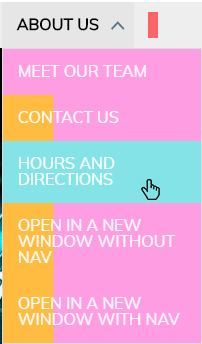 |
| The links will turn a highlighted color to signify that you have checked the link.  Added for ease of use when QA'ing |

### **Spellcheck Page** 

* This tool will highlight all misspelled words along with all words/phrases that are banned by the OEM. 

#### **Turning the tool on:** 

* Click the 'web page test' button inside the 'qa tools' panel. 

#### **Turning the tool off:** 

-- When you are done using the tool, simply click the "turn off" on the legend and the tool will turn itself off.  

#### **Features** 

* All misspelled words will be highlighted in red. 
* All banned words will be highlighted in yellow. The banned word lists were compiled by reading requirements from OEM's at the \[\\Las-mgmt1.lasisi01a.las.san.dsghost.net\associate\sea\CS\++AssetRepository\]. You can find the compiled list of Banned Words for each OEM that is used by the tool here: [Banned Word List](https://github.com/cirept/QA_Toolbox/tree/7b8726987f1e7bcf68aa2eac0751ead9e02c96b3/resources/OEM_Banned_Words.json)  
* There are some contexts were a word that is highlighted as banned may be acceptable. You can read about them here: [Banned Context](bannedcontext.md)  

| Spell Check Results Example |
| :--- |
| 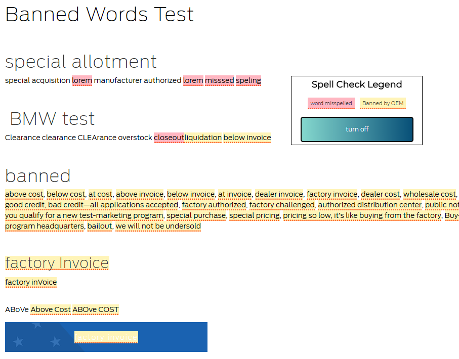 |
| _**Please verify that all the words on the page is in fact spelt wrong, and that the context of the banned word warrants it being banned \(For example, meet or beat is often banned for pricing, but not for general use\)**_ |

### **Web Page Test** 

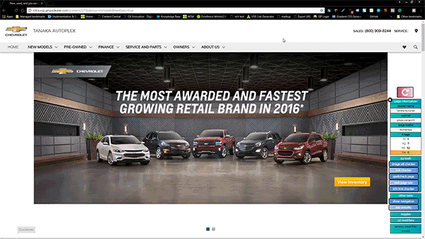

* This tool will send in a query to WebPageTest.org of the currently viewed page. 
* When clicking 'Web Page Test' button, a submenu will appear with advanced settings. These default settings will result in a typical test and should only be changed under specific circumstances.  

  _**This tool works for both TETRA and NEXTGEN**_  

#### Turning the tool on: 

* Click the 'web page test' button inside the 'qa tools' panel. 

#### **Features** 

**Enter Email**  

* Filling out this field with your work email \(e.g. firstName.lastName@cdk.com\) will send you an email when your tests have been completed. 

**Choose Browser**  

* This setting will change the browser that your tests will be conducted in. 
* The three \(3\) major browsers are available to choose from. 
* By default IE11 is the ideal test candidate and should always be set as the browser to test in. 
* The only scenario that the browser settings should be changed is in the event that the IE11 servers are down, at which point selecting any of the remaining two \(2\) browsers will be necessary.

**Choose Key**  

* This setting has been introduced to allow additional users to send in tests using this tool.  

  **Each key is alotted a total of 200 tests per day.**  

  _**Every query request sent by this tool results in a total of three \(3\) tests**_ to be made, so as you can see that reaching that 200 limit per day can be quite easy.  

* In the event that you receive an error message upon viewing the results page on WebPageTest.org mentioning the limit has been reached for the day, please choose a different key from the drop down and send in another test. 

#### Web Page Test Results 

* Once the setting have been set up, hit the 'send test' button and your test will be sent in. 
* A new tab will open with the page already queued up for speed testing. 
* Once the testing has been completed the results of the test will be displayed. 

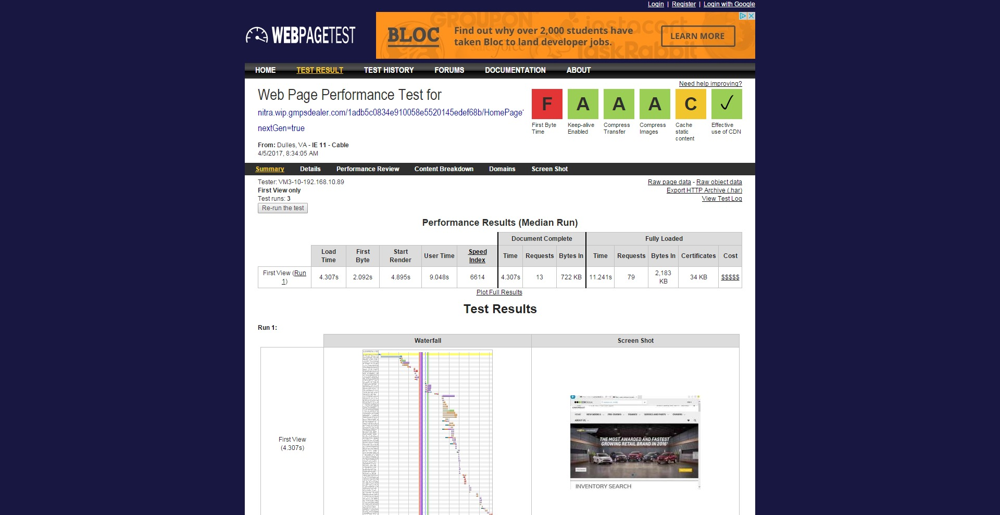

&gt;

> The results will show the page load times for the site. The results page will also help with determining what is causing slow load times if necessary.  
>
>
> Benchmark for desktop site = load time &lt; 10 sec.

### **404 Link Checker** 

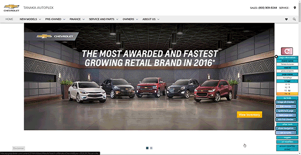

* This tool will check every link on the site and highlight the link according to what the results of the test is. 
* All the links on the page will be tested for validity and then will be highlighted accordingly. 
* For the most part only links that are internal links will be eligible to be flagged as 'Link is Real' due to security restrictions. 
* This tool also appends "URL: " followed by the url of the link after the link's title  

  _**This tool works for both TETRA and NEXTGEN**_  

#### Turning the tool on: 

* Click the '404 link checker' button inside the 'qa tools' panel. 

#### Turning the tool off: 

* When you are done using the tool, **please refresh the page** before running any other tool. 

#### **Features** 

| 404 Link Checker Legend |
| :--- |
| 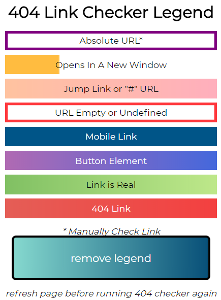 |
| _**'Absolute URL**_**'\*** |
| All links that have a complete URL \(e.g. [http://nitra.wip.gmpsdealer.com/content15/VehicleSearchResults?search=new](http://nitra.wip.gmpsdealer.com/content15/VehicleSearchResults?search=new)\) as the link will be flagged.  All links that lead outside the site \(e.g. [https://confluence.cdk.com/display/DEV/CX+Innovation](https://confluence.cdk.com/display/DEV/CX+Innovation)\) will be flagged.  |
| _**'Opens in new window**_**'\*** |
| All links that open in a new window will be flagged. This style will mix with link is real, 404 link and absolute url to show as much information as possible. |
| _**'f\_link'**_ |
| All links that force the page to be framed in. **This is more common on TETRA then in NEXTGEN** |
| _**'Empty URL'**_ |
| All links that have an _empty_ url.  All links that begin with a "\#". _links are usually related to anchor links OR is meant to bring the user back to the homepage._  All links that are meant for mobile. _phone number links on NEXTGEN that will._ e.g. phone link in the masthead on a NEXTGEN site\* |
| _**'Link is Real'**_ |
| All links that lead to an actual page will be flagged. |
| _**'404 Link'**_ |
| All links that result in a 404 error \(link leads to a page that doesn't exist\) with be flagged and should be addressed. |
| _**'Href'**_ |
| For every link, "URL: " followed by the url\(href\) of the link will be appended to the title of the link following, "URL: ". |

## **Other Tools Panel** 

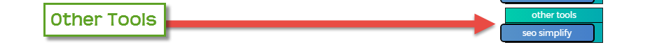

* These tools are here to ease the process of QA'ing a site.

### **Show Navigation** 

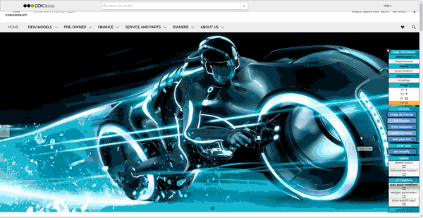

#### **TIP:** 

> _Show Navigation + Link Checker can and should be used together to verify links in the navigation are correct._

* This tool will allow the user to see all of the navigation menu without having to hover over the main navigation item. 
* All subnavigation items will display for easier QA checking. 
* When you are done using the tool, simply click the "turn off" on the legend and the tool will turn itself off.  

  _**This tool works for both TETRA and NEXTGEN**_  

#### **Turning the tool on:** 

* Click the 'show navigation' button inside the 'qa tools' panel. 

#### **Turning the tool off:** 

* When you are done using the tool, simply click the "turn off" on the legend and the tool will turn itself off. 

| Show Navigation Legend |
| :--- |
| 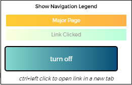 |
| _**The "major page" color will only be applied when the tool is run on a TETRA site.  NEXTGEN has this feature disabled.**_ |

#### **Features** 

| Show Navigation Functionality |
| :--- |
| 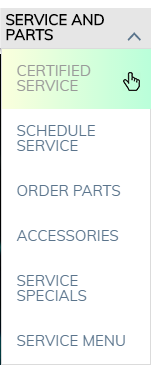 |
| When clicking on any subnavigation item, it will turn the link a different color to signify that you have checked the link. _**Added to help keep track of what links you have already checked.**_ |

### **SEO Simplify** 

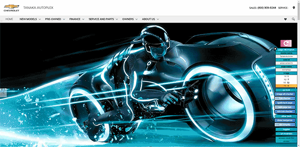

* This tool will aid in formatting SEO text that is taken from a live site that is formatted using css. 
* This tool will provide a simplified version of the code you input.  Ready for pasting into a NextGen card.  

  _**This tool works for both TETRA and NEXTGEN**_  

#### Turning the tool on: 

* Click the 'seo simplify' button inside the 'other tools' panel. 

#### **Features** 

* After raw SEO text has been entered, a pop up will display with the 'simplified' SEO text. 
* All styles, italics, bold, center, underline, span tags will be removed. 
* The pop up will have display the SEO text according to the styles of the current page you are on. 
* Clicking in the text area will allow the user to copy all of the html code of the new SEO text. 
* To remove the pop up, click on the 'remove' button at the top of the pop up. 

## **Toggles Panel** 

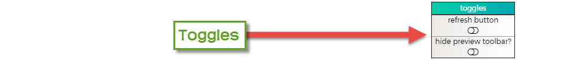

* These tools are here to make for convenience's sake. 

### **Refresh Button** 

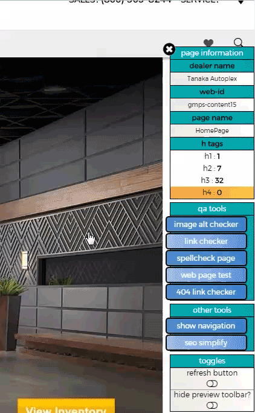

* This tool will allow access to a refresh button that will provide a similar functionality as using the keyboard shortcut ctrl+f5 on a webpage. 
* To hide/show the button, switch the control on/off.  

  **This tool works for both TETRA and NEXTGEN.**

### **Hide Preview Toolbar** 

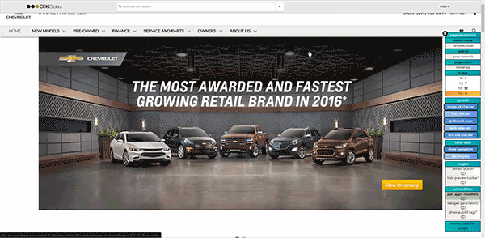

* This tool will hide the PCE toolbar that appears at the top of CDK sites. 
* To hide/show the button, switch the control on/off.  

  **This tool works for both TETRA and NEXTGEN.**  

## **URL Modifiers Panel** 

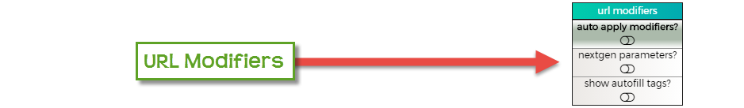

### **Auto Apply Modifiers** 

* This tool allows the tool to automatically apply the URL parameters of the URL modifications within this panel. 
* When switching this toggle on, it will determine if the current page you are viewing has the desired URL parameters added to it. 
* If the URL is missing a parameter the page will automatically refresh with the URL parameter added to it. 

Test Scenario  

* e.g. _current URL_ = [http://nitra.proof.gmpsdealer.com/content15](http://nitra.proof.gmpsdealer.com/content15) 
  * I want to see the NEXTGEN version of my sandbox TETRA site and also want to make sure that all subsequent windows that I open are also the NEXTGEN version of my sandbox site. 
    1. I switch the **'nextgen parameters?'** toggle **ON** 
    2. Then I switch the **'auto apply modifiers?'** toggle **ON**. 

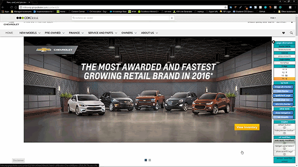

* This will cause the page to refresh and the NEXTGEN version of the site visible. 
* _new URL_ = [http://nitra.proof.gmpsdealer.com/content15?nextGen=true](http://nitra.proof.gmpsdealer.com/content15?nextGen=true) 
* These settings will also automatically apply 'nextGen=true' to all windows that I open from now on, until I turn the 'auto apply modifiers?' toggle _**off**_ 

#### _**How To Use**_ 

1. Switch the toggles on for the URL parameters you want to add to the URL
   * Nextgen Parameters?  ON or OFF
   * Show Autofill Tags?  ON or OFF
2. Turn of 'Auto Apply Modifiers' switch

#### _**How To Change Settings While 'Auto Apply Modifiers' Is Already Active**_

1. Switch the toggles on/off for the URL parameters you want to add/remove to the URL
   * Nextgen Parameters?  ON or OFF
   * Show Autofill Tags?  ON or OFF
2. Refresh the page
   * Quickly toggle the "Auto Apply Modifiers" switch ON then OFF

     **OR**

   * If you have the "Refresh Button" turned on \(in toggles panel\), click that button

     **OR**

   * Do a manual refresh of the page

### **Nextgen Parameters?** 

* This tool controls the logic of the 'auto apply modifiers' toggle. 
* When switching this toggle into the **ON** or **OFF** position will cause the main tool to act differently. 
* **This is also how you control which version of the tool you want to use.**  

  _**This tool works in both TETRA and NEXTGEN.**_  

_**If work is strictly related to NEXTGEN, please have this toggle always on to ensure that every page you view will be the NEXTGEN version of the page.**_  

* There is an issue when going viewing a NEXTGEN site, you are suddenly shown the TETRA version.  This fixes that issue. 

#### ON position 

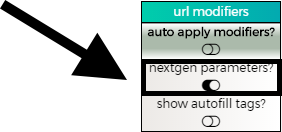

* This will cause the 'auto apply modifiers' tool \(when switched on\) to search the current URL and see if _**"nextGen=true"**_ is present in the URL. 
* If the parameter is not detected the tool will refresh the page with the parameter added to it. 
  * **OLD URL** = [http://nitra.proof.gmpsdealer.com/content15](http://nitra.proof.gmpsdealer.com/content15) 
  * **NEW URL** = [http://nitra.proof.gmpsdealer.com/content15?nextGen=true](http://nitra.proof.gmpsdealer.com/content15?nextGen=true) 
* If _**"nextGen=false"**_ is detected in the URL, the page will refresh with the parameter now having a _**false**_ value. 
  * **OLD URL** = [http://nitra.proof.gmpsdealer.com/content15?nextGen=false](http://nitra.proof.gmpsdealer.com/content15?nextGen=false) 
  * **NEW URL** = [http://nitra.proof.gmpsdealer.com/content15?nextGen=true](http://nitra.proof.gmpsdealer.com/content15?nextGen=true) 
* If  _**"nextGen=true"**_ is detected in the URL, nothing will happen.  :\] 
  * **URL** = [http://nitra.proof.gmpsdealer.com/content15?nextGen=true](http://nitra.proof.gmpsdealer.com/content15?nextGen=true) 

#### OFF position 

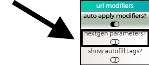

This will cause the 'auto apply modifiers' tool \(when switched on\) to search the current URL and see if _**"nextGen=false"**_ is present in the URL.  

* If the parameter is not detected the tool will refresh the page with the parameter added to it. 
  * **OLD URL** = [http://nitra.proof.gmpsdealer.com/content15](http://nitra.proof.gmpsdealer.com/content15) 
  * **NEW URL** = [http://nitra.proof.gmpsdealer.com/content15?nextGen=false](http://nitra.proof.gmpsdealer.com/content15?nextGen=false) 
* If _**"nextGen=true"**_ is detected in the URL, the page will refresh with the parameter now having a _**false**_ value. 
  * **OLD URL** = [http://nitra.proof.gmpsdealer.com/content15?nextGen=true](http://nitra.proof.gmpsdealer.com/content15?nextGen=true) 
    * **NEW URL** = [http://nitra.proof.gmpsdealer.com/content15?nextGen=false](http://nitra.proof.gmpsdealer.com/content15?nextGen=false) 
* If _**"nextGen=false"**_ is detected in the URL, nothing will happen. :\] 
  * [http://nitra.proof.gmpsdealer.com/content15?nextGen=false](http://nitra.proof.gmpsdealer.com/content15?nextGen=false) 

### Show Autofill Tags? 

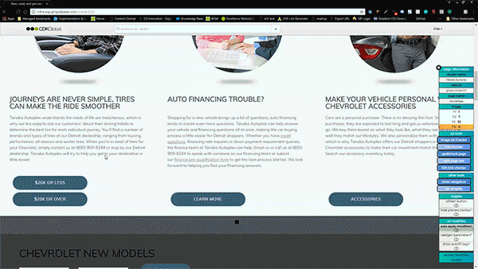

* This tool controls the logic of the 'auto apply modifiers' toggle. 
* When switching this toggle into the **ON** or **OFF** position will cause the main tool to act differently.  

  **This tool works in both TETRA and NEXTGEN.**

#### ON position 

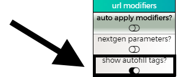

* This will cause the 'auto apply modifiers' tool \(when switched on\) to search the current URL and see if _**"disableAutofill=true"**_ is present in the URL. 
* If the parameter is not detected the tool will refresh the page with the parameter added to it. 
  * **OLD URL** = [http://nitra.proof.gmpsdealer.com/content15](http://nitra.proof.gmpsdealer.com/content15) 
  * **NEW URL** = [http://nitra.proof.gmpsdealer.com/content15?disableAutofill=true](http://nitra.proof.gmpsdealer.com/content15?disableAutofill=true) 
* If _**"disableAutofill=false"**_ is detected in the URL, the page will refresh with the parameter now having a _**false**_ value. 
  * **OLD URL** = [http://nitra.proof.gmpsdealer.com/content15?disableAutofill=false](http://nitra.proof.gmpsdealer.com/content15?disableAutofill=false) 
  * **NEW URL** = [http://nitra.proof.gmpsdealer.com/content15?disableAutofill=true](http://nitra.proof.gmpsdealer.com/content15?disableAutofill=true) 
* If  _**"disableAutofill=true"**_ is detected in the URL, nothing will happen.  :\] 
  * **URL** = [http://nitra.proof.gmpsdealer.com/content15?disableAutofill=true](http://nitra.proof.gmpsdealer.com/content15?disableAutofill=true) 

#### OFF position 

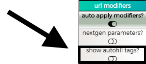

* This will cause the 'auto apply modifiers' tool \(when switched on\) to search the current URL and see if _**"disableAutofill=false"**_ is present in the URL. 
* If the parameter is not detected the tool will refresh the page with the parameter added to it.
  * **OLD URL** = [http://nitra.proof.gmpsdealer.com/content15](http://nitra.proof.gmpsdealer.com/content15)
  * **NEW URL** = [http://nitra.proof.gmpsdealer.com/content15?disableAutofill=false](http://nitra.proof.gmpsdealer.com/content15?disableAutofill=false)
* If _**"disableAutofill=true"**_ is detected in the URL, the page will refresh with the parameter now having a _**false**_ value.
  * **OLD URL** = [http://nitra.proof.gmpsdealer.com/content15?disableAutofill=true](http://nitra.proof.gmpsdealer.com/content15?disableAutofill=true)
    * **NEW URL** = [http://nitra.proof.gmpsdealer.com/content15?disableAutofill=false](http://nitra.proof.gmpsdealer.com/content15?disableAutofill=false)
* If _**"disableAutofill=false"**_ is detected in the URL, nothing will happen. :\]
  * [http://nitra.proof.gmpsdealer.com/content15?disableAutofill=false](http://nitra.proof.gmpsdealer.com/content15?disableAutofill=false)

