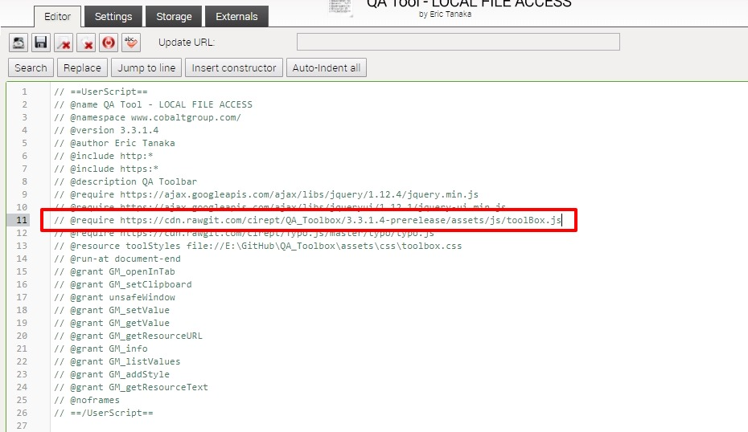
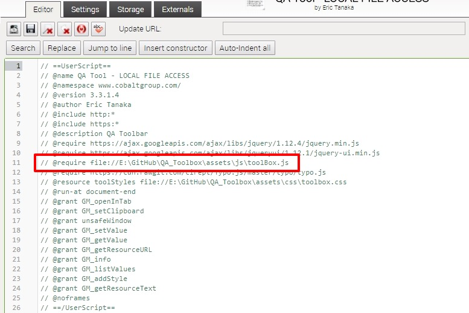
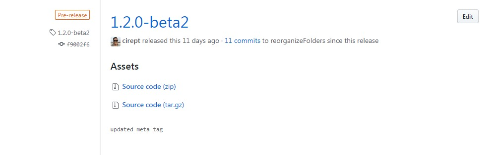
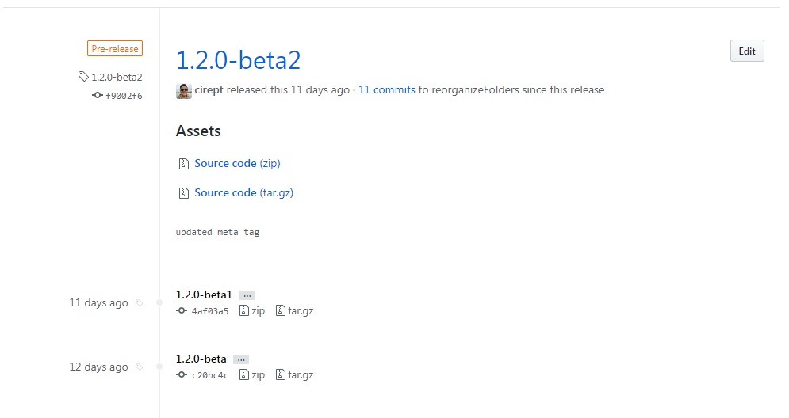
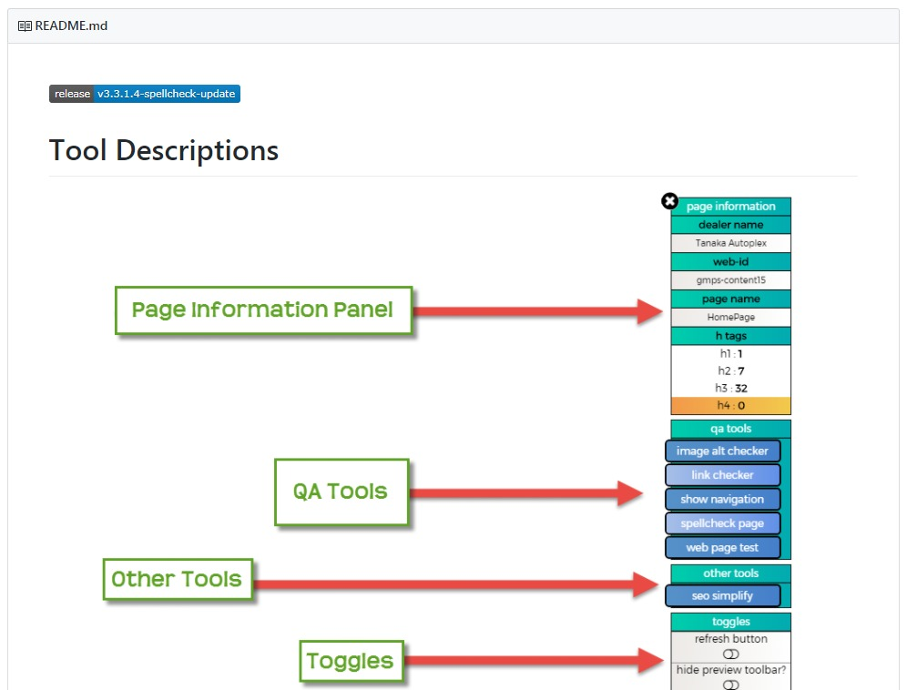
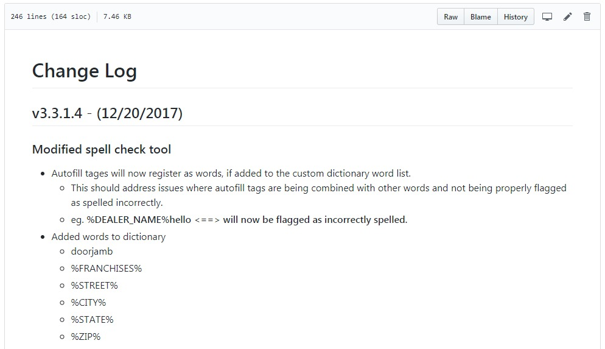
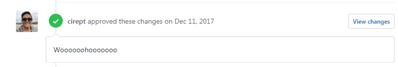
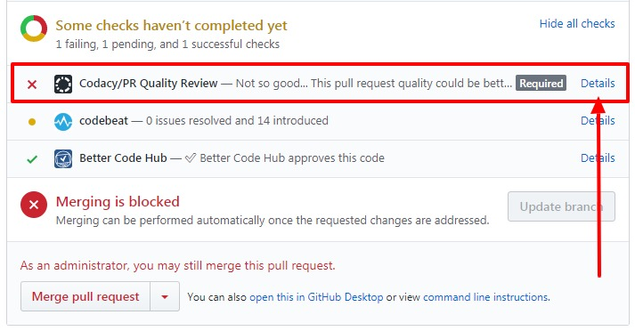

# how to update the QA Tool

**first a little back story behind this particular process**

- Please follow these instructions when performing modifications to the tool in order to quickly and easily get your changes approved and published to all the QA Tool's users.  If you find a better way.  Then I am all ears.  :]

- If you are not familiar with using Github, don't fret!  There are a ton of guides out there to learn the git workflow.  Here are a few good resources to start you off.
    - https://guides.github.com/introduction/flow/
    - https://gist.github.com/blackfalcon/8428401

- The QA Tool is a custom userscript and uses Tampermonkey as a primary userscript manager so I hope you are familiar with it.  And when I say familiar, all I mean is just know how to:
    1. add a usersctipt
    2. modify a userscript
    3. how to force an update request.  <-- I will provide instructions on this step

 
 

---

 
 

## and we are off!   :rocket:
In order to modify this tool just follow these simple steps:
1. [Create your custom branch](#Create-your-custom-branch)
2. [Update your branch with your new tool or enhancement](#Update-your-branch)
3. [Test your new code, using Tampermonkey](#Test-your-code)
4. [Documentation](#Documentation)
5. [Open a pull request to get your code merged with the master and sent out to the world!](#Open-a-pull-request)

**Easy Right!?**

Allow me to explain these steps in depth to make it as easy as possible to update this tool.

 
 

---

 
 

## Create your custom branch

Create a branch from the 'master' repo on GitHub, please use a descriptive name in order to clearly identify branch purpose.

- if you are unable to do so, that means you do not have permission to modify the code.
Please contact the code owner(s) to get set up with the proper permissions.

 
 

---

 
 

### Updating your branch

> **Tip:**  Add a linter addon to your preferred IDE.  Any popular IDE out there should have linter addons for your to install.  Shoot for adding a linter that uses **ESLint.**

1. write your code and update your branch with w/e enhancement or new tool that your heart desires.

2. if using Tampermonkey, you can write your code and test it very easily.  I will explain this in this next.

> **Additional Tip:**
- This project uses strict **ESLint rules**, that are in place to help others read your code, but it often times helps YOU read your own code.  Have you ever had one of those days where you pump out a bazilion lines of code then revisit it a day later then not no what you are looking at?  Well this should help this not happen!

With Tampermonkey, you are able to laod your local js file and run it on the webpage!  Greeaaatttt right?!  Here's how!

**Discalimer: these steps have only been tested with Chrome, so yeah...**

If you don't already have Tampermonkey installed on your Chrome browser, please do so now.

1. Navigate to the **Extensions** menu.

    - Click the link to learn how [https://support.google.com/chrome_webstore/answer/2664769?hl=en](https://support.google.com/chrome_webstore/answer/2664769?hl=en)

2. Find the "Tampermonkey" extension.  *if you have a ton of extensions, the list may be long.  Keep scrolling and you should find it eventually*

3. There will be TWO (2) CHECKBOXES:
    - "Allow in incognito"
    - "Allow access to file URLs"    <-- **CHECK THIS OPTION**

4. You are done with this tab, close it out.
5. Click on the Tampermonkey icon in your "extension logo soup" area.

> 

6. Navigate to "Dashboard", the dashboard will show you all the userscripts installed in Tampermonkey.
7. Create a duplicate copy of the QA Tool userscript. We are going to modify the code.
8. Replace the @require line of code to the main JS file, which should look like this.

> 

> // @require https://cdn.rawgit.com/cirept/QA_Toolbox/3.3.1.4-prerelease/assets/js/toolBox.js

**Replace it with**

> // @require file://FULL_FILE_PATH_TO_YOUR_CUSTOM_JS_FILE

> 

You're done!  Navigate to a CDK page and reload the page, you should see YOUR version of the QA Tool.

[for more information on getting Tampermonkey to read your local js file](https://forum.tampermonkey.net/viewtopic.php?t=316)

Build away!

 
 

---

 
 

## Test your code
In this step we will create a pre-release version of the QA Tool.  This step will help weed out any issues that you may encounter when publishing your release to the world.  But before we create a pre-release there is a file that needs updating.

### Update the meta.js file

- QA_Toolbox/assets/js/meta.js

Please update these lines in the meta.js file

> **@version X.X.X.X**
- update the version number to what will be the latest version when your changes gets published.  For example, if the current version is 3.3.1 that would mean when your changes are published the version you will be using could be 3.4 or 3.3.2, depending on the modifications you are making (more on Semantic Versioning later).  So you would put either of those two version numbers here.

> **@require https://cdn.rawgit.com/cirept/QA_Toolbox/XXXXXXXXXX/assets/js/toolBox.js**
- update the file path to link to the PRE-RELEASE version you will create.

### Create a Pre-Release
Now we are ready to create a pre-release version of the QA Tool with YOUR code.

- [Click here to learn how to create a Release](https://help.github.com/articles/creating-releases/).

> Do not forget to select "This is a pre-release" at the bottom of the release creation page to ensure that your changes are published pre-maturely

Please follow the semantic versioning increments of the current QA Tool.

> 

- if the current version is 3.3.1.4, YOUR version should be **3.3.1.5-beta** or **3.3.2-alpha** or **3.4-beta** depending on the type of update you are making.  For more information on Semantic Versioning, [see here](http://semver.org/).
- One more thing to note is how I included, -beta, -alpha.  This is recommended during the testing phase to reserve that version number for YOUR release, in the event that various updates are made at once.  Once you get your changes merged to the master branch, you should drop the extra fluff in the version number and it will be just the number.  **3.3.1.5** or **3.3.2** or **3.4**.

### Multiple Pre-Releases
If for some reason, you need to create multiple pre-releases.  Perhaps the meta.js file wasn't updated before you created the pre-release.  Please overwrite your current pre-release.
- while on the "Releases" page, simply click the "Edit" button for your pre-release and update the TAG VERSION area.

    - :star: the 'tag version' input will be the first input box on the page.

- If you do create multiple pre-releases, please delete unused copies as they will convolute the Release section.  **Goal here is to be able to see the latest release on the first page!**

*Here is an example of what the RELEASE page should look like if you overwrote your pre-releases correctly.*
> 

 
 

---

 
 

## Documentation

Markdown is used to create the documentation.  It won't be hard to learn.  I promise.

- **Please update the README.md** file with detailed information on the tool that you created or modified.  Follow the general outline of the current README when creating a new section or updating information.

> 

- **Please update the ChangeLog.md** file with a general overview of the changes you made to the tool.  Again follow the general outline of the current information on the ChangeLog file when creating a new section.

> 

 
 

---

 
 

## Open a pull request

For a quick overview of how to create a pull request. Read [How to do a pull request](https://help.github.com/articles/creating-a-pull-request/)

Additional resources:
- [about pull requests](https://help.github.com/articles/about-pull-requests/)
- [commenting on a pull request](https://help.github.com/articles/commenting-on-a-pull-request/)

**When you create a pull request, please perform these steps:**
1. Please include a **summary** of what changes that you made in the comments of the pull request.

2. Add a **link to the pre-release version** in the comments so the reviewers can easily find the version you want to merge
    - this pre-release should be the same pre-release you tested in the previous phase.

The review process is split into two (2) parts: **Human Review** and **Code Quality**.

### Human Review

#### The 'human review' portion:

1. test if the update works
2. is it bug free
3. does it work as expected from reading the README documentation.
4. Are the instructions easy to understand?
4. Enhancement suggestions that would make the tool better? *(up to you if you want to develop these features)*

You know the typical QA stuff. I can't stress enough that the documentation is important!  The goal of the README instructions is to be as *clear as possible*.  You want your documentation to be good enough where you can send them a link to the README page and be done with them!

:star2: An approval review will be given if all the criteria are met.

> 

:x: If there are changes needed, the reviewer will place them in the pull request as a comment.

> 

#### The 'code quality' portion:

1. Codacy pass :white_check_mark: / fail :x: grade

**Simple enough.**

If you followed my tip and installed a linter, this part shouldn't take long.

=)

In fact, you might get a passing grade first try!

=(

If you don't get a passing grade first try, you can navigate to the Codacy page and see what issues you need to fix.

> 

It is a requirement to get a passing grade by **Codacy**.
> For more info on Codacy, please check out their [site](https://www.codacy.com/product).

For this project we are using **ESLint rules** and **Codacy** has been set up using said ESLint rules.  The rules are may be strict at first, but you will get used to writing code with rules.  ***These rules help create quality code that is easy to maintain AND make it easy for humans to read.***  There are also "best practice" rules as well to ensure that everyone is using good habits while writing code.

> This may take long depending on the quality of code that was written.

> **Look at it as a learning experience!**

> **You are learning how to refactor your code!**

> Learning how to do things differently, sometimes more efficiently, is the name of the game here.  **Efficient** *almost always* **= speed**.
