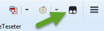
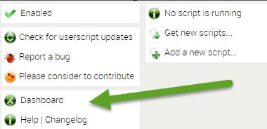
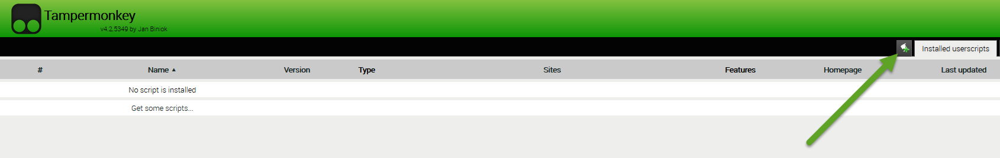
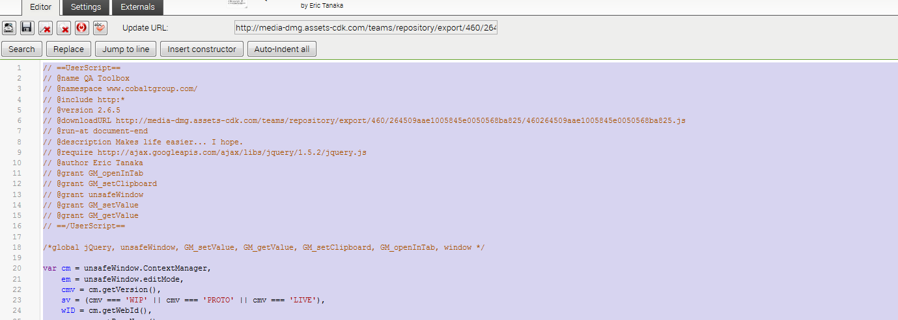
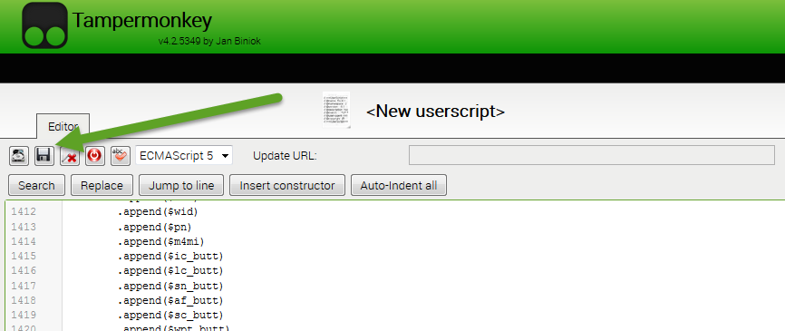

# Install

## Toolbar Install Instructions

### Browser Extension Install Instructions

Tampermonkey is a browser add-on that is used to run the toolbar web app, please install the add-on.

#### Links to Browser Add-Ons 

_Please middle wheel click on the mouse to open links in a new tab_  

**Chrome**  

[Tampermonkey for Chrome _**\(open in Chrome browser\)**_](https://chrome.google.com/webstore/detail/tampermonkey/dhdgffkkebhmkfjojejmpbldmpobfkfo?hl=en)

For additional help installing Chrome Extensions, Please check out this guide : [https://support.google.com/chrome\_webstore/answer/2664769?hl=en&ref\_topic=6238977](https://support.google.com/chrome_webstore/answer/2664769?hl=en&ref_topic=6238977)

**Firefox**  

:new: **Tampermonkey is now available on FireFox.**

[Tampermonkey for Firefox _**\(open in FireFox browser\)**_](https://addons.mozilla.org/en-US/firefox/addon/tampermonkey/)

For additional help installing FireFox Extensions, Please check out this guide : [https://www.accessfirefox.org/Addons\_Installation\_Guide.php](https://www.accessfirefox.org/Addons_Installation_Guide.php)

**ie11 does not support his extension**  

Once the Tampermonkey extension has been installed, please continue to the next set of instructions for installing the userscript.

### Tampermonkey UserScript Installation Instructions

:new:  
 **If you have Tampermonkey installed, after clicking on the "Latest Code" text link Tampermonkey will detect the script and will install it for you. Please click the "Install" button in the page that appears and that is all you need to do to install the toolbar.** :sweat\_smile:

**If the magic does not happen for you. I am sorry to hear that. :cry:**   
**Please follow the rest of the steps below in order to install the toolbar.**   

#### 1. Open the link below in a new tab.  Copy all of the code.

Link to Latest Toolbar Code:  
 [Latest Code](https://raw.githubusercontent.com/cirept/QA_Toolbox/master/assets/js/meta.user.js)  
 _open in a new tab_

#### 2. Click the add-on icon in your browser

#### 3. Click on 'Dashboard' menu item 

This will open a new tab with the extension dashboard displayed _**\(seen in step 3\)**_

#### 4. Click the icon to add a new userscript 

The icon is located next to "Install userscripts" tab.

#### 5. Select all text in textarea and paste the code you copied in the 1st step.

#### 6. Click the floppy disk to save your changes

**7. Done. The toolbar will show up on any Proof/Live CDK site** :thumbsup:

## Tool descriptions

click [here](README.md)

